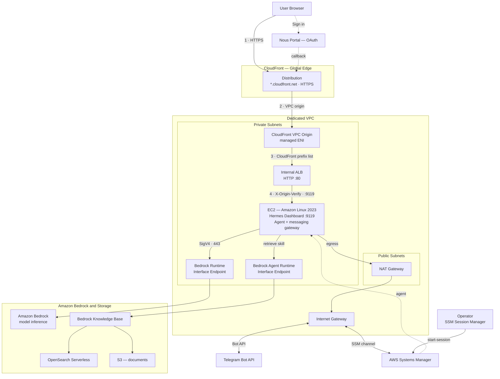

# Running Hermes Agent Safely on AWS

English | [한국어](./README_ko.md)

This repository deploys Hermes Agent standalone on AWS. Instead of reusing an
existing environment, it creates a dedicated VPC, an EC2 instance in a private
subnet, an IAM Role, a Bedrock VPC Endpoint, a NAT Gateway, an ALB, and
CloudFront. Use the Hermes Dashboard on the web, and optionally configure a
separate messaging gateway to chat from Telegram and other platforms.

```text
Browser
  -> CloudFront (HTTPS)
  -> CloudFront VPC Origin (ENI inside the VPC)
  -> Internal ALB (CloudFront origin verification)
  -> EC2 private IP:9119
  -> Hermes Dashboard

Telegram
  <-> Hermes messaging gateway on EC2
  -> NAT Gateway
  -> Telegram Bot API

Hermes Agent
  -> Bedrock Runtime VPC Endpoint
  -> Amazon Bedrock
  -> retrieve skill
  -> Bedrock Knowledge Base / S3 / OpenSearch Serverless
```

The ALB and CloudFront exist to expose the Dashboard to the outside world
safely. The ALB is an internal ALB in private subnets; CloudFront connects to
it directly through a VPC origin, so it is never exposed to the internet.
Telegram polling does not need the ALB, but it does require the NAT Gateway
for the EC2 instance's outbound internet access.

The full architecture, including subnet placement, security-group paths, and
VPC endpoints:



Security groups enforce each hop: the ALB only accepts port 80 from the
CloudFront-managed prefix list, the EC2 instance only accepts port 9119 from
the ALB security group, and the VPC endpoints only accept port 443 from the
EC2 security group. Bedrock traffic stays inside the VPC via interface
endpoints, while Telegram, SSM, and package downloads egress through the NAT
Gateway.

## Prerequisites

- Python 3.10 or later
- Deployment permissions configured in the AWS CLI
- Amazon Bedrock model access enabled in the target Region
- A Nous Portal account for public Dashboard login
- `boto3` installed

```bash
python3 -m pip install -r requirements.txt
aws sts get-caller-identity
```

## Installing on AWS

The public Dashboard uses Nous OAuth, the officially recommended method for
Hermes. Because the CloudFront callback URL is created during deployment,
installation is a two-step process.

First, create the infrastructure. During this step the service is kept
stopped so that an unauthenticated Dashboard is never exposed.

```bash
python3 installer.py
```

The installer creates a CloudFront VPC origin that connects directly to the
internal ALB in the private subnets. No separate domain or certificate is
needed; the user-facing URL is the default CloudFront domain.

Register the OAuth callback URL recorded in
`assets/hermes-deployment-info.md` at
[Nous Portal Local Dashboards](https://portal.nousresearch.com/local-dashboards)
and obtain a client ID in the `agent:...` format. Then re-run the installer
with the same options plus the client ID.

```bash
python3 installer.py \
  --dashboard-oauth-client-id agent:<ID>
```

The installer applies the OAuth settings via SSM and starts the Dashboard.
Running the same command against an existing username/password deployment
removes the basic-auth settings and switches it to OAuth.

The CloudFront domain changes every time the distribution is recreated. If
you reuse an existing client ID after reinstalling, login fails with
`redirect_uri_mismatch`; update the URL of the Nous Portal registration to
the new callback URL. See the
[CloudFront guide](./docs/cloudfront-setup.md#로그인-시-redirect_uri_mismatch)
for the detailed procedure.

Defaults are `us-west-2`, `t3.medium`, with CloudFront and the Knowledge
Base enabled. Key options:

```bash
python3 installer.py \
  --region us-west-2 \
  --instance-type t3.medium \
  --model-id global.anthropic.claude-sonnet-5
```

```text
--dashboard-oauth-client-id ID   Nous Portal OAuth client ID (agent:...)
--disable-knowledge-base        Skip Knowledge Base related resources
--skip-browser                  Skip Chromium install for the Hermes browser tool
```

`--disable-cloudfront` is not supported because it would expose Dashboard
login over public HTTP.

Installation results are stored in the following files:

- `assets/hermes-deployment.json`: deployment state used for re-runs and deletion
- `assets/hermes-deployment-info.md`: access URL, OAuth callback, operating commands

The state file may contain the origin verification secret, so do not share
it externally. Re-running the installer with the same options reuses or
repairs resources based on the stored state.

## Accessing the Dashboard

After completing the OAuth setup, open the URL from
`assets/hermes-deployment-info.md` in a browser and choose **Sign in with
Nous Research**. The Hermes Dashboard is served on port `9119` by the
`hermes-dashboard.service` unit the installer created.

```bash
aws ssm start-session \
  --target <INSTANCE_ID> \
  --region us-west-2

sudo systemctl status hermes-dashboard.service
sudo journalctl -u hermes-dashboard.service -f
```

Because the ALB is internal, it cannot be reached directly from the
internet; only requests forwarded by CloudFront through the VPC origin that
carry the matching origin verification header are passed to EC2. See the
[ALB guide](./docs/alb-setup.md) and the
[CloudFront guide](./docs/cloudfront-setup.md) for details.

## Connecting Telegram

The Dashboard and the Telegram gateway are separate processes. The installer
only starts the Dashboard automatically, so to use Telegram you must run the
official Hermes gateway setup once on the EC2 instance.

```bash
aws ssm start-session \
  --target <INSTANCE_ID> \
  --region us-west-2

sudo su - ec2-user
hermes gateway setup
hermes gateway install
hermes gateway start
hermes gateway status --deep
```

In the setup wizard, choose Telegram and the token issued by BotFather. With
DM pairing, approve the code a user receives like this:

```bash
hermes pairing list
hermes pairing approve telegram <CODE>
```

Never write tokens directly on the command line or in documents. Hermes
stores secrets in `~/.hermes/.env`. See the
[Telegram guide](./docs/telegram-setup.md) for the full procedure and
troubleshooting.

## Using Hermes on EC2

The initial shell over SSM is `ssm-user`, so switch to `ec2-user`, where
Hermes is installed.

```bash
sudo su - ec2-user
hermes --version
hermes doctor
hermes config show
hermes dashboard --status
hermes gateway status
```

Start a terminal conversation with:

```bash
hermes
```

To ask a single question:

```bash
hermes chat -q "Summarize the current project"
```

More commands are covered in the [usage guide](./docs/use_command.md).

## Installing on a Personal Machine

Use the official installer.

```bash
curl -fsSL https://hermes-agent.nousresearch.com/install.sh | bash
hermes setup
```

The AWS installer in this repository uses an EC2 Instance Profile, so no AWS
access keys are stored on the instance. When using Bedrock from a personal
machine, configure the standard credential chain separately, such as an AWS
CLI profile or SSO.

## Bedrock Model Configuration

For AWS deployments, the installer creates the following structure in
`~/.hermes/config.yaml`.

```yaml
model:
  default: global.anthropic.claude-sonnet-5
  provider: bedrock
  base_url: https://bedrock-runtime.us-west-2.amazonaws.com
bedrock:
  region: us-west-2
```

To change the model, specify a Bedrock model or inference profile ID that is
available in the Region and that your account has access to.

```bash
hermes model
hermes config set model.default <BEDROCK_MODEL_ID>
hermes config check
```

On EC2 instances managed by the installer, the Instance Profile provides
authentication, so do not set `AWS_ACCESS_KEY_ID` or
`AWS_SECRET_ACCESS_KEY`.

## Skills

You can list installed skills and search for or install skills from the
registry.

```bash
hermes skills list
hermes skills search "document"
hermes skills inspect <IDENTIFIER>
hermes skills install <IDENTIFIER>
hermes skills audit
```

When the Knowledge Base is enabled, the installer places the retrieve skill
in `~/.hermes/skills/retrieve`. Search documents from chat with `/retrieve
<question>`, or verify directly on EC2:

```bash
python3 ~/.hermes/skills/retrieve/scripts/retrieve_search.py \
  "Causes and fixes for the error code"
```

## Cron

The gateway must stay running for scheduled jobs to be processed.

```bash
hermes cron create "0 9 * * *" \
  "Summarize today's operational status" \
  --name daily-status \
  --deliver telegram

hermes cron list
hermes cron status
hermes cron run <JOB_ID>
hermes cron pause <JOB_ID>
hermes cron resume <JOB_ID>
hermes cron remove <JOB_ID>
```

## Installing the Kiro CLI

To use the Kiro CLI alongside Hermes, connect to EC2 over SSM and switch to
`ec2-user`.

```bash
sudo su - ec2-user
curl -fsSL https://cli.kiro.dev/install | bash
kiro-cli login --use-device-flow
kiro-cli chat
```

Kiro CLI authentication and billing are separate from Hermes and from the
IAM Role created by this repository.

## Connecting Gmail

Prepare the tools and OAuth credentials required by Hermes's Google
Workspace skills. If you use `gog`, install and authenticate on a local
machine like this:

```bash
brew install steipete/tap/gogcli
gog auth credentials /path/to/client_secret.json
gog auth add your-email@gmail.com --services gmail,calendar,drive,contacts
gog auth list
```

Enable the Gmail, Calendar, and Drive APIs in the Google Cloud Console and
use an OAuth client of the Desktop app type. If you need to handle the OAuth
callback on a headless EC2 instance, use the Dashboard's terminal or the
guided device flow, and never commit credential files to the repository.

## Registering Documents in the Knowledge Base

By default the installer creates S3, OpenSearch Serverless, a Bedrock
Knowledge Base, and the retrieve skill together. Place supported documents
under `contents/` and run:

```bash
python3 add_content.py
```

Supported formats are PDF, TXT, Markdown, HTML, CSV, DOC/DOCX, and
XLS/XLSX. Files are re-uploaded only when their SHA-256 changes, and if
anything changed the script waits for ingestion to complete.

```bash
# Also delete documents from S3 that no longer exist locally
python3 add_content.py --delete-missing

# Start ingestion even when no documents changed
python3 add_content.py --force-sync

# Exit right after starting ingestion without waiting
python3 add_content.py --no-wait
```

Existing documents such as `contents/error_code.pdf` are indexed as-is when
placed in the same directory. Deployment identifiers are not hardcoded; they
are read from `assets/hermes-deployment.json`.

## Updating

Use the official Hermes updater, then restart the service.

```bash
sudo su - ec2-user
hermes update
exit

sudo systemctl restart hermes-dashboard.service
```

If you installed the Telegram gateway, restart it separately as `ec2-user`.

```bash
sudo su - ec2-user
hermes gateway restart
hermes gateway status --deep
```

## Deleting the Infrastructure

Only managed resources are deleted, based on the
`assets/hermes-deployment.json` file the installer recorded. The CloudFront
distribution and VPC origin are deleted first, followed by the ALB and the
VPC.

```bash
python3 uninstaller.py
```

Instances created manually with `create-instance.sh` use different tags and
are not managed by this uninstaller.

## Detailed Documentation

- [AWS manual deployment guide](./docs/hermes-aws-deploy.md)
- [ALB setup](./docs/alb-setup.md)
- [CloudFront setup](./docs/cloudfront-setup.md)
- [Telegram setup](./docs/telegram-setup.md)
- [Hermes commands and operations](./docs/use_command.md)
- [Retrieve skill](./skills/retrieve/SKILL.md)

## Reference

- [Hermes Agent GitHub](https://github.com/NousResearch/hermes-agent)
- [Hermes Agent Documentation](https://hermes-agent.nousresearch.com/docs/)
- [Amazon Bedrock Knowledge Bases](https://docs.aws.amazon.com/bedrock/latest/userguide/knowledge-base.html)
- [AWS Systems Manager Session Manager](https://docs.aws.amazon.com/systems-manager/latest/userguide/session-manager.html)
- [kyopark2014/openclaw](https://github.com/kyopark2014/openclaw)

## Acknowledgements

The AWS deployment approach in this repository references
[kyopark2014/openclaw](https://github.com/kyopark2014/openclaw). Many thanks to
[kyopark2014](https://github.com/kyopark2014) for sharing that work.
